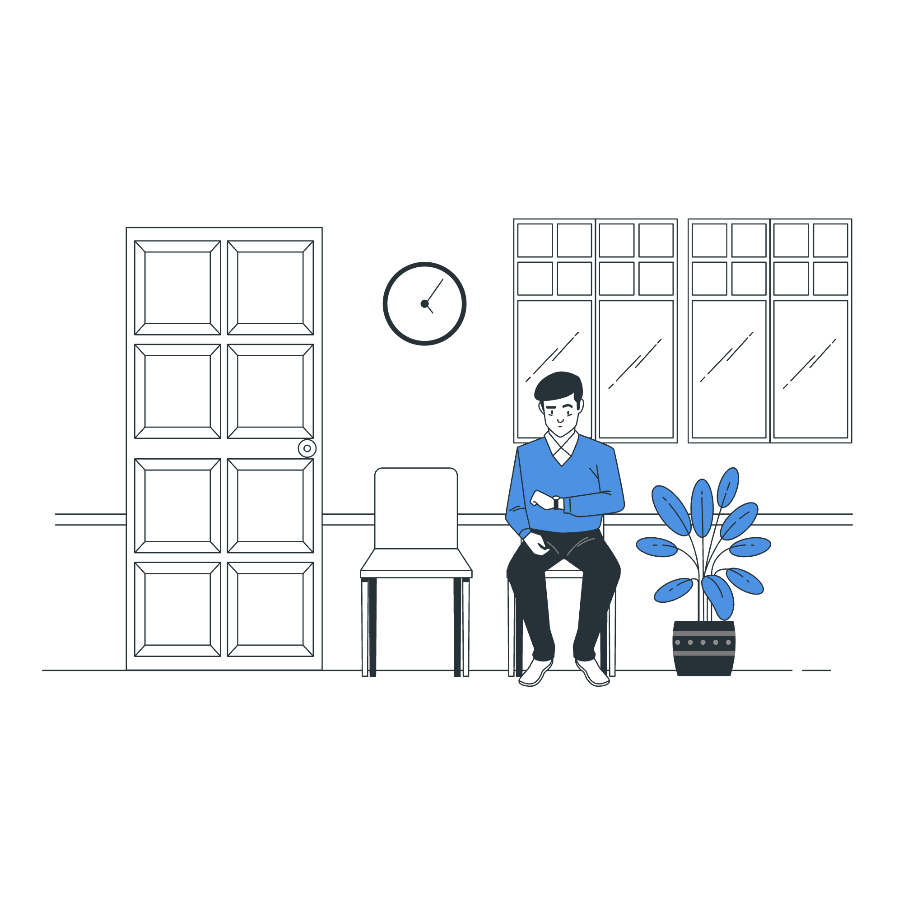

# doctor_flutter

# Date: 30 November 2024

## Summary

- Minor UI improvements
- Bug fixes
- Added Reels section
- Updated UI splash, login, and registration
- Appointment and reels notifications now navigate directly to the respective screens

#### Updated Files

- [AndroidManifest.xml](android/app/src/main/AndroidManifest.xml)
- [Info.plist](ios/Runner/Info.plist)
- [appointment_detail_screen.dart](lib/screen/appointment_detail_screen/appointment_detail_screen.dart)
- [appointment_detail_screen_controller.dart](lib/screen/appointment_detail_screen/appointment_detail_screen_controller.dart)
- [ad_medical_sheet.dart](lib/screen/medical_prescription_screen/widget/ad_medical_sheet.dart)
- [add_bank_detail_screen_controller.dart](lib/screen/add_bank_detail_screen/add_bank_detail_screen_controller.dart)
- [add_slot_dialog.dart](lib/screen/appointment_slots_screen/widget/add_slot_dialog.dart)
- [api_service.dart](lib/service/api_service.dart)
- [appointment_card.dart](lib/screen/appointment_screen/widget/appointment_card.dart)
- [appointment_chat_screen_controller.dart](lib/screen/appointment_chat_screen/appointment_chat_screen_controller.dart)
- [appointment_detail_card.dart](lib/screen/appointment_detail_screen/widget/appointment_detail_card.dart)
- [appointment_detail_list.dart](lib/screen/appointment_chat_screen/widget/appointment_detail_list.dart)
- [appointment_detail_screen.dart](lib/screen/appointment_detail_screen/appointment_detail_screen.dart)
- [appointment_detail_screen_controller.dart](lib/screen/appointment_detail_screen/appointment_detail_screen_controller.dart)
- [appointment_history_screen.dart](lib/screen/appointment_history_screen/appointment_history_screen.dart)
- [appointment_history_screen_controller.dart](lib/screen/appointment_history_screen/appointment_history_screen_controller.dart)
- [appointment_screen.dart](lib/screen/appointment_screen/appointment_screen.dart)
- [appointment_screen_controller.dart](lib/screen/appointment_screen/appointment_screen_controller.dart)
- [appointment_slots_screen_controller.dart](lib/screen/appointment_slots_screen/appointment_slots_screen_controller.dart)
- [asset_res.dart](lib/utils/asset_res.dart)
- [attachment_card.dart](lib/screen/appointment_detail_screen/widget/attachment_card.dart)
- [award_page.dart](lib/screen/profile_screen/widget/award_page.dart)
- [bottom_sheet_one_text_field.dart](lib/screen/services_screen/widget/bottom_sheet_one_text_field.dart)
- [build.gradle](android/app/build.gradle)
- [chart_box.dart](lib/screen/earning_report_screen/widget/chart_box.dart)
- [chat.dart](lib/model/chat/chat.dart)
- [chat_bottom_text_filed.dart](lib/common/chat_widget/chat_bottom_text_filed.dart)
- [color_res.dart](lib/utils/color_res.dart)
- [comment_sheet.dart](lib/screen/reels_screen/reel/widget/comment_sheet.dart)
- [common_fun.dart](lib/common/common_fun.dart)
- [const_res.dart](lib/utils/const_res.dart)
- [custom_animated_bottom_bar.dart](lib/screen/dashboard_screen/widget/custom_animated_bottom_bar.dart)
- [custom_ui.dart](lib/common/custom_ui.dart)
- [dashboard_screen.dart](lib/screen/dashboard_screen/dashboard_screen.dart)
- [dashboard_screen_controller.dart](lib/screen/dashboard_screen/dashboard_screen_controller.dart)
- [delete_account_sheet.dart](lib/screen/setting_screen/widget/delete_account_sheet.dart)
- [detail_page.dart](lib/screen/profile_screen/widget/detail_page.dart)
- [doctor_profile_screen_one_controller.dart](lib/screen/doctor_registration_screen/doctor_profile_screen_one/doctor_profile_screen_one_controller.dart)
- [doctor_profile_screen_three.dart](lib/screen/doctor_registration_screen/doctor_profile_screen_three/doctor_profile_screen_three.dart)
- [doctor_profile_screen_three_controller.dart](lib/screen/doctor_registration_screen/doctor_profile_screen_three/doctor_profile_screen_three_controller.dart)
- [doctor_profile_screen_two_controller.dart](lib/screen/doctor_registration_screen/doctor_profile_screen_two/doctor_profile_screen_two_controller.dart)
- [doctor_profile_text_filed.dart](lib/common/doctor_profile_text_filed.dart)
- [doctor_reg_button.dart](lib/common/doctor_reg_button.dart)
- [drop_down_menu.dart](lib/screen/doctor_registration_screen/starting_profile_screen/widget/drop_down_menu.dart)
- [earning_report_screen.dart](lib/screen/earning_report_screen/earning_report_screen.dart)
- [education_page.dart](lib/screen/profile_screen/widget/education_page.dart)- [education_page.dart]()
- [experience_page.dart](lib/screen/profile_screen/widget/experience_page.dart)- [experience_page.dart]()
- [extention.dart](lib/utils/extention.dart)
- [fancy_button.dart](lib/common/fancy_button.dart)
- [firebase_res.dart](lib/utils/firebase_res.dart)
- [font_res.dart](lib/utils/font_res.dart)
- [forgot_password_sheet.dart](lib/screen/login_screen/widget/forgot_password_sheet.dart)
- [gradle-wrapper.properties](android/gradle/wrapper/gradle-wrapper.properties)
- [image_builder_custom.dart](lib/common/image_builder_custom.dart)
- [image_preview_screen.dart](lib/screen/image_preview_screen/image_preview_screen.dart)
- [image_send_sheet.dart](lib/common/image_send_sheet.dart)
- [intl_ar.arb](lib/l10n/intl_ar.arb)
- [intl_da.arb](lib/l10n/intl_da.arb)
- [intl_de.arb](lib/l10n/intl_de.arb)
- [intl_el.arb](lib/l10n/intl_el.arb)
- [intl_en.arb](lib/l10n/intl_en.arb)
- [intl_es.arb](lib/l10n/intl_es.arb)
- [intl_fr.arb](lib/l10n/intl_fr.arb)
- [intl_hi.arb](lib/l10n/intl_hi.arb)
- [intl_id.arb](lib/l10n/intl_id.arb)
- [intl_it.arb](lib/l10n/intl_it.arb)
- [intl_ja.arb](lib/l10n/intl_ja.arb)
- [intl_ko.arb](lib/l10n/intl_ko.arb)
- [intl_nb.arb](lib/l10n/intl_nb.arb)
- [intl_nl.arb](lib/l10n/intl_nl.arb)
- [intl_pl.arb](lib/l10n/intl_pl.arb)
- [intl_pt.arb](lib/l10n/intl_pt.arb)
- [intl_ru.arb](lib/l10n/intl_ru.arb)
- [intl_th.arb](lib/l10n/intl_th.arb)
- [intl_tr.arb](lib/l10n/intl_tr.arb)
- [intl_vi.arb](lib/l10n/intl_vi.arb)
- [intl_zh.arb](lib/l10n/intl_zh.arb)
- [languages.dart](lib/screen/profile_screen/widget/languages.dart)
- [list_minus.png](assets/icon/list_minus.png)
- [list_of_category.dart](lib/screen/help_and_faq_screen/widget/list_of_category.dart)
- [login_screen.dart](lib/screen/login_screen/login_screen.dart)
- [login_screen_controller.dart](lib/screen/login_screen/login_screen_controller.dart)
- [main.dart](lib/main.dart)
- [manage_holiday_screen_controller.dart](lib/screen/manage_holiday_screen/manage_holiday_screen_controller.dart)
- [mark_complete_sheet.dart](lib/screen/appointment_detail_screen/widget/mark_complete_sheet.dart)
- [medical_prescription_screen_controller.dart](lib/screen/medical_prescription_screen/medical_prescription_screen_controller.dart)
- [message_card.dart](lib/screen/message_screen/widget/message_card.dart)
- [message_center_area.dart](lib/screen/message_chat_screen/widget/message_center_area.dart)
- [message_chat_screen.dart](lib/screen/message_chat_screen/message_chat_screen.dart)
- [message_chat_screen_controller.dart](lib/screen/message_chat_screen/message_chat_screen_controller.dart)
- [message_chat_top_bar.dart](lib/screen/message_chat_screen/widget/message_chat_top_bar.dart)
- [message_screen.dart](lib/screen/message_screen/message_screen.dart)
- [message_screen_controller.dart](lib/screen/message_screen/message_screen_controller.dart)
- [mobile_number_box.dart](lib/common/mobile_number_box.dart)
- [my_app.dart](lib/screen/my_app/my_app.dart)
- [my_app_controller.dart](lib/screen/my_app/my_app_controller.dart)
- [notification_screen.dart](lib/screen/notification_screen/notification_screen.dart)
- [personal_information_screen.dart](lib/screen/personal_information_screen/personal_information_screen.dart)
- [personal_information_screen_controller.dart](lib/screen/personal_information_screen/personal_information_screen_controller.dart)
- [Podfile.lock](ios/Podfile.lock)
- [pref_service.dart](lib/service/pref_service.dart)
- [preview_reel.dart](lib/screen/upload_reel_screen/widget/preview_reel.dart)
- [previous_appointment.dart](lib/screen/appointment_detail_screen/widget/previous_appointment.dart)
- [previous_appointment_screen.dart](lib/screen/previous_appointment_screen/previous_appointment_screen.dart)
- [problem_card.dart](lib/screen/appointment_detail_screen/widget/problem_card.dart)
- [profile_detail_screen.dart](lib/screen/profile_detail_screen/profile_detail_screen.dart)
- [profile_screen.dart](lib/screen/profile_screen/profile_screen.dart)
- [profile_screen_controller.dart](lib/screen/profile_screen/profile_screen_controller.dart)
- [profile_top_bar_card.dart](lib/screen/profile_screen/widget/profile_top_bar_card.dart)
- [pubspec.yaml](pubspec.yaml)
- [qr_scanner.dart](lib/screen/appointment_screen/widget/qr_scanner.dart)
- [registration.dart](lib/model/doctorProfile/registration/registration.dart)
- [registration_screen.dart](lib/screen/registration_screen/registration_screen.dart)
- [registration_screen_controller.dart](lib/screen/registration_screen/registration_screen_controller.dart)
- [registration_successful_screen.dart](lib/screen/registration_successful_screen.dart/registration_successful_screen.dart)
- [request_card.dart](lib/screen/request_screen/widget/request_card.dart)
- [request_screen.dart](lib/screen/request_screen/request_screen.dart)
- [request_screen_controller.dart](lib/screen/request_screen/request_screen_controller.dart)
- [review_page.dart](lib/screen/profile_screen/widget/review_page.dart)
- [select_category_screen.dart](lib/screen/doctor_registration_screen/select_category_screen/select_category_screen.dart)
- [select_category_screen_controller.dart](lib/screen/doctor_registration_screen/select_category_screen/select_category_screen_controller.dart)
- [service_location_screen_controller.dart](lib/screen/service_location_screen/service_location_screen_controller.dart)
- [services_screen.dart](lib/screen/services_screen/services_screen.dart)
- [services_screen_controller.dart](lib/screen/services_screen/services_screen_controller.dart)
- [setting_screen.dart](lib/screen/setting_screen/setting_screen.dart)
- [setting_screen_controller.dart](lib/screen/setting_screen/setting_screen_controller.dart)
- [settings.gradle](android/settings.gradle)
- [splash_screen.dart](lib/screen/splash_screen/splash_screen.dart)
- [splash_screen_controller.dart](lib/screen/splash_screen/splash_screen_controller.dart)
- [starting_profile_screen_controller.dart](lib/screen/doctor_registration_screen/starting_profile_screen/starting_profile_screen_controller.dart)
- [suggest_us_sheet.dart](lib/screen/doctor_registration_screen/select_category_screen/widget/suggest_us_sheet.dart)
- [text_button_custom.dart](lib/common/text_button_custom.dart)
- [top_bar_area_appointment.dart](lib/screen/appointment_screen/widget/top_bar_area_appointment.dart)
- [top_bar_tab.dart](lib/common/top_bar_tab.dart)
- [update_res.dart](lib/utils/update_res.dart)
- [urls.dart](lib/utils/urls.dart)
- [video_call_screen_controller.dart](lib/screen/video_call_screen/video_call_screen_controller.dart)
- [wallet_screen_controller.dart](lib/screen/wallet_screen/wallet_screen_controller.dart)

#### Added Files

- [ProductSans-Light.ttf](assets/fonts/ProductSans-Light.ttf)
- [ProductSans-Medium.ttf](assets/fonts/ProductSans-Medium.ttf)
- [ProductSans-Regular.ttf](assets/fonts/ProductSans-Regular.ttf)
- 
- 
- 
- 
- 
- 
- 
- 
- 
- 
- 
- 
- 
- 
- 
- 
- 
- 
- 
- 
- 
- 
- 
- 
- [custom_round_btn.dart](lib/common/custom_round_btn.dart)
- [reel_screen.dart](lib/screen/reels_screen/reel/reel_screen.dart)
- [reel_screen_controller.dart](lib/screen/reels_screen/reel/reel_screen_controller.dart)
- [reels_screen.dart](lib/screen/reels_screen/reels_screen.dart)
- [reels_screen_controller.dart](lib/screen/reels_screen/reels_screen_controller.dart)
- [upload_reel_screen.dart](lib/screen/upload_reel_screen/upload_reel_screen.dart)
- [reels.dart](lib/model/reel/reels.dart)
- [preview_reel.dart](lib/screen/upload_reel_screen/widget/preview_reel.dart)
- [upload_reel_screen_controller.dart](lib/screen/upload_reel_screen/upload_reel_screen_controller.dart)
- [image_builder_custom.dart](lib/common/image_builder_custom.dart)
- [add_comment.dart](lib/model/reel/add_comment.dart)
- [add_reel.dart](lib/model/reel/add_reel.dart)
- [fetch_comment.dart](lib/model/reel/fetch_comment.dart)
- [confirmation_dialog.dart](lib/common/confirmation_dialog.dart)
- [firebase_notification_manager.dart](lib/service/firebase_notification_manager.dart)
- [no_post.dart](lib/screen/reels_screen/widget/no_post.dart)
- [reels_top_bar.dart](lib/screen/reels_screen/widget/reels_top_bar.dart)
- [comment_sheet.dart](lib/screen/reels_screen/reel/widget/comment_sheet.dart)
- [report_sheet.dart](lib/screen/reels_screen/reel/widget/report_sheet.dart)
- [saved_reels_screen.dart](lib/screen/saved_reels_screen/saved_reels_screen.dart)
- [saved_reels_screen_controller.dart](lib/screen/saved_reels_screen/saved_reels_screen_controller.dart)

#### Deleted Files

- auth_screen.dart
- noAppointment.gif
- otp_sheet.dart
- otp_sheet_controller.dart

----------------------------------------------------------------------------------------------------

# Date: 07 Oct 2024

## Summary

- update `pubspec.yaml` file
- Remove `intl_phone_number_input: ^0.7.4` Library
- Replace Library `mobile_scanner: ^5.1.1` To `qr_code_scanner_plus: ^2.0.6`
- Default `appLanguageCode` Variable add in [const_res.dart](lib/utils/const_res.dart)

#### Updated Files

- [pubspec.yaml](pubspec.yaml)
- accept_reject_screen.dart
- accept_reject_screen_controller.dart
- add_bank_detail_screen_controller.dart
- appointment_chat_screen_controller.dart
- appointment_screen.dart
- common_fun.dart
- const_res.dart
- doctor_profile_screen_one_controller.dart
- languages_screen_controller.dart
- main.dart
- message_chat_screen_controller.dart
- mobile_number_box.dart
- otp_sheet.dart
- otp_sheet_controller.dart
- personal_information_screen.dart
- personal_information_screen_controller.dart
- qr_scanner.dart
- select_category_screen_controller.dart
- service_location_screen_controller.dart
- splash_screen.dart
- starting_profile_screen.dart
- starting_profile_screen_controller.dart
- video_call_placeholder.dart
- video_call_screen.dart
- video_preview_screen_controller.dart

#### Added Files

None

#### Deleted Files

None

----------------------------------------------------------------------------------------------------
# Date: 18 July 2024

## Summary

- "Push Notification" String english to greek

#### Updated Files

- [intl_el.arb](lib/l10n/intl_el.arb)
- custom_animated_bottom_bar.dart

#### Added Files

None

#### Deleted Files

None

-----------------------------------------------------------------------------------

# Date: 16 July 2024

## Summary

- Show & Edit Doctor Category
- Country code issue fixed
- Remove [Qr_code_scanner](/pubspec.yaml) or
  Add [mobile_scanner: ^5.1.1](https://pub.dev/packages/mobile_scanner)

#### Updated Files

- [AppDelegate.swift](/ios/Runner/AppDelegate.swift)
- [Podfile](/ios/Podfile)
- [pubspec.yaml](/pubspec.yaml)
- accept_reject_screen.dart
- api_service.dart
- appointment_chat_screen_controller.dart
- appointment_detail_card.dart
- chart_box.dart
- const_res.dart
- custom_ui.dart
- doctor_profile_screen_one.dart
- doctor_profile_screen_one_controller.dart
- fetch_user_detail.dart
- intl_ar.arb
- intl_da.arb
- intl_de.arb
- intl_el.arb
- intl_en.arb
- intl_es.arb
- intl_fr.arb
- intl_hi.arb
- intl_id.arb
- intl_it.arb
- intl_ja.arb
- intl_ko.arb
- intl_nb.arb
- intl_nl.arb
- intl_pl.arb
- intl_pt.arb
- intl_ru.arb
- intl_th.arb
- intl_tr.arb
- intl_vi.arb
- intl_zh.arb
- login_screen_controller.dart
- main.dart
- mark_complete_sheet.dart
- messages_en.dart
- my_app.dart
- my_app_controller.dart
- personal_information_screen.dart
- personal_information_screen_controller.dart
- profile_detail_screen.dart
- profile_screen.dart
- registration_screen_controller.dart
- review_page.dart
- select_category_screen.dart
- select_category_screen_controller.dart
- service_location_screen.dart
- service_location_screen_controller.dart
- services_screen.dart
- services_screen_controller.dart
- splash_screen.dart
- splash_screen_controller.dart
- starting_profile_screen.dart
- starting_profile_screen_controller.dart
- video_call_placeholder.dart
- video_call_screen.dart

#### Added Files

None

#### Deleted Files

None

----------------------------------------------------------------------------------------------------

# Date: 10 May 2024

## Summary
- Gradle Migration

#### Updated Files
- build.gradle
- build.gradle
- gradle.properties
- gradle-wrapper.properties
- l10n.dart
- main.dart
- pubspec.lock
- pubspec.yaml
- settings.gradle

#### Added Files
- proguard-rules.pro

#### Deleted Files

None

----------------------------------------------------------------------------------------------------

# Date: 27 March 2024

## Summary
Chat Id Changes :-

- Example
  doctorId =1;
  patientId =1;

- Now
  patientId = 1P
  doctorId=1D

- Notification Bug Fixed
